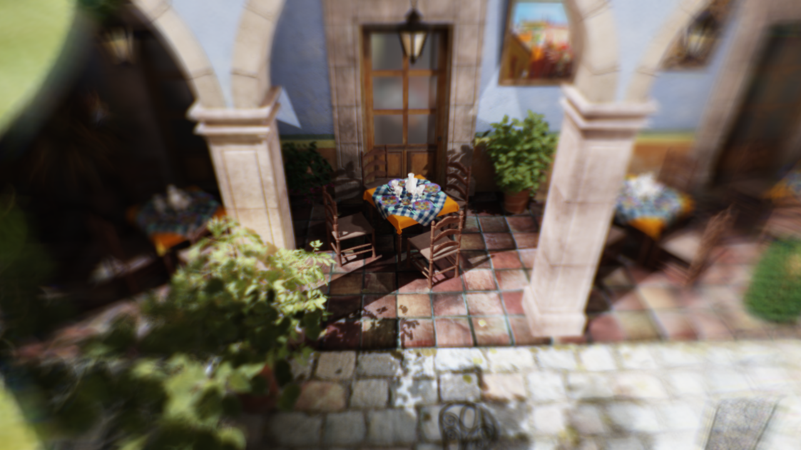
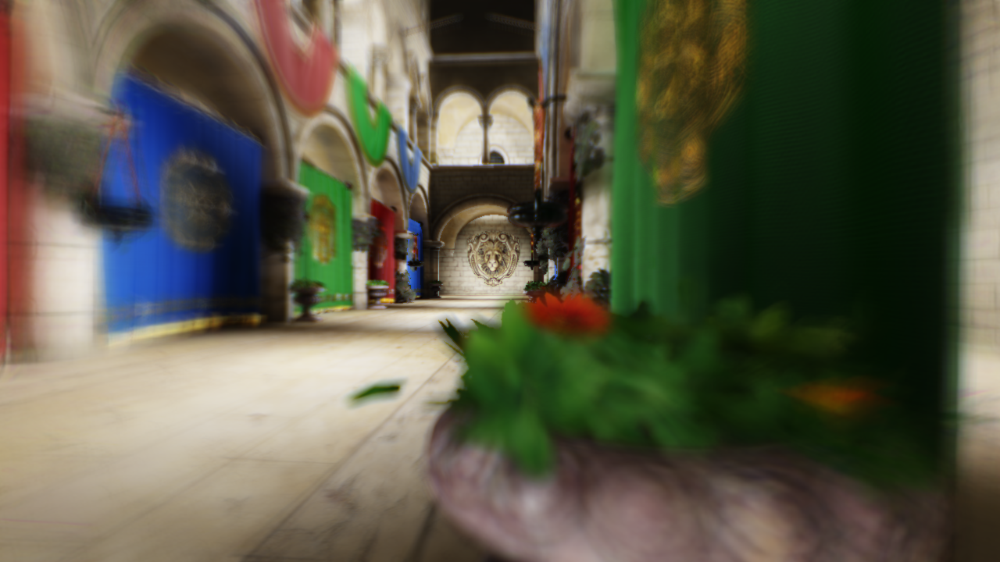
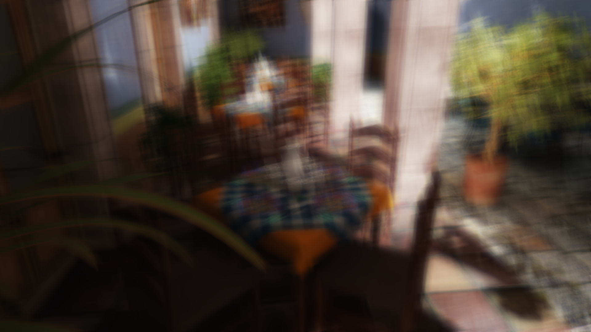
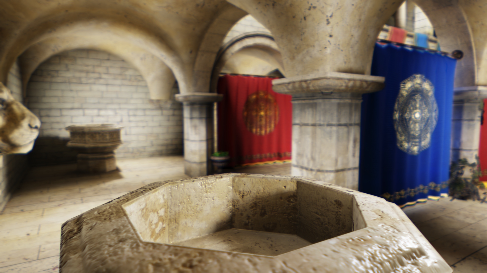

# Vision Simulation Test Framework

This is the framework I implemented during my PhD studies for developing and testing our algorithms relating to the real-time simulation of human vision.

## Main features of the framework

- 3D scene and camera management.
  - Utilizes a custom entity-component system.
  - Automatic library and source code discovery.
  - On-the-fly update and render graph building.
- Custom command-line configuration implementation.
- Logging with multiple output devices.
  - Console, files, in-memory.
  - Automatic scoped logging regions.
- A job-system.
- Easy-to-use, thread-based distribution of work.
- Rich editor interface with extensive debugging capabilities.
  - Highly customizable and themeable.
  - Dockable interface elements..
  - GPU object (shader, buffer, texture) inspection.
  - On-the-fly entity and material editing.
  - Extensive in-memory log inspector.
- Key-frame animations.
  - Automatic recording of key-frames based on user interaction.
  - Real-time and lock-step playback with optional video output.
- CPU and GPU profiling.
  - Automatic, scoped, nested regions.
  - Configurable tabular logging of the results.
  - Observable on-the-fly in a graphical and tree form.

### Rendering

- Implemented using OpenGL 4.
- Custom shader compilation supporting `#include` statements and detailed error reports.
- Phong and Blinn-Phong shading models.
- Physically-based shading using the Cook-Torrance model.
- Deferred shading with support for HDR rendering.
- Normal mapping.
- Layered rendering.
- Content and time-adaptive local and global tone mapping.
  - Multiple tone mapping operators are supported.
- Multisample anti-aliasing (MSAA).
- Direct and indirect lighting.
  - Multiple source types (directional, point, spot).
  - Shadow mapping with several different filtering approaches (variance, exponential, moments).
  - Voxel global illumination.
- CPU occlusion culling.
- Cubemap-based skyboxes and volumetric clouds.
- Post-process filters:
  - Motion blur.
  - Fast approximate anti-aliasing (FXAA).
  - Debug visualizers for GBuffer and voxel grid contents.
  - Color look-up tables.
  - Simulation of aberrated vision.

## Requirements

### Hardware

The framework makes heavy use of compute shaders; therefore, an OpenGL 4.3 compatible video card is required.

For reference, all tests and performance measurements published in our papers were performed on the following system configuration:

- **CPU**: AMD Ryzen 7 1700X
- **GPU**: NVIDIA TITAN Xp
- **Memory**: 32 GBytes

### Software

The framework requires the following external software:

- [Microsoft Visual Studio](https://visualstudio.microsoft.com/vs/)
    - Tested with v16.6.3.
    - [SmartCommandlineArguments](https://marketplace.visualstudio.com/items?itemName=MBulli.SmartCommandlineArguments) is recommended (`.json` file is auto-generated by build script).
- [MATLAB](https://www.mathworks.com/products/matlab.html)
    - Tested with R2020b.
    - Required toolboxes:
      - Eye reconstruction method of Csoba and Kunkli:
        - [Optimization](https://www.mathworks.com/products/optimization.html)
        - [Global Optimization](https://www.mathworks.com/products/global-optimization.html)
        - [Parallel Computing](https://www.mathworks.com/products/parallel-computing.html)
      - PSNR computation:
        - [Image Processing](https://www.mathworks.com/products/image.html)
- [Python](https://www.mathworks.com/products/matlab.html)
  - Tested with version 3.8.6.
  - List of main dependencies, with the version used during our tests in parentheses:
    - numpy (1.18.5)
    - tensorflow (2.5.0)
    - tensorflow_addons (0.13.0)
    - keras_tuner (1.0.3)
    - humanize (3.1.0)
    - matplotlib (3.3.4)
    - pandas (1.1.3)
    - psutil (5.9.0)
    - seaborn (0.11.2)
    - tabulate (0.8.9)
  - Note that this list is incomplete and only includes the most relevant third-party packages.

### Third-party libraries

All third-party libraries are omitted due to file size limitations. The necessary binaries for building with VS 2019 can be downloaded from [here](https://unidebhu-my.sharepoint.com/:u:/g/personal/csoba_istvan_inf_unideb_hu/Ecw5NQRdltNFk61E1H1JeUcBk9uBU2ag_JIXCnueOzNNrA?e=kkEVpQ). All third-party library files should be placed in the [Libraries](Libraries) folder.

### Third-party assets

While some of the necessary assets are uploaded along with the source code, most of the third-party meshes and textures are omitted due to file size limitations. They can be downloaded from [here](https://unidebhu-my.sharepoint.com/:u:/g/personal/csoba_istvan_inf_unideb_hu/EfvMCe3XCvtAk8HdAQ77ewQBxnNT_fHhjlzVPuccnBIj5A?e=JhYbjB), and should be placed in the corresponding subfolders of the [Assets](Assets) folder.


## Running the framework

### Generating training datasets

The datasets can be generated using Python. To this end, open a terminal, navigate to the [Assets/Scripts/Python](Assets/Scripts/Python) folder, then use the following commands to generate the datasets:

```
python eye_reconstruction.py generate aberration_estimator
python eye_reconstruction.py generate eye_estimator
python eye_aberrations.py generate aberration_estimator
python eye_refocusing.py generate refocus_estimator dataset
```

Each command is responsible for generating a single dataset for the corresponding networks. The datasets used to perform the measurements for our papers can be downloaded from [here](https://unidebhu-my.sharepoint.com/:u:/g/personal/csoba_istvan_inf_unideb_hu/EcuEr51d8B9NtXwCWWNZVY0BbLkt1UJShSuw973eTIX4LA?e=IEEIEy), and should be placed in the [Assets/Scripts/Python/Data/Train](Assets/Scripts/Python/Data/Train) folder.

Training is then performed using the following set of commands:

```
python eye_reconstruction.py train aberration_estimator network
python eye_reconstruction.py train eye_estimator network
python eye_aberrations.py train aberration_estimator network
python eye_refocusing.py train refocus_estimator network
```
Once finished, the exported files will be available in the [Assets/Scripts/Python/Networks](Assets/Scripts/Python/Networks) folder.

Lastly, the trained networks must be manually exported for use with the C++ framework. To this end, the following commands must be used:

```
python eye_reconstruction.py export aberration_estimator network
python eye_reconstruction.py export eye_estimator network
python eye_aberrations.py export aberration_estimator network
python eye_refocusing.py export refocus_estimator network
```

Once finished, the exported files will be available in the [Assets/Generated/Networks](Assets/Generated/Networks) folder.

### Generating build files for the C++ backend

The framework relies on [Premake5](https://github.com/premake/premake-core/releases) to generate the necessary project files. Premake5 is included in the archive; to invoke it, use the following command in the project's main folder:

```
premake5 --matlab_root=$PATH$ vs2019
```

where `$PATH$` is the path to the MATLAB installation's root folder. 

The build script assumes a MATLAB R2020b installation by default (`c:/Program Files/MATLAB/R2020b/`), so the `--matlab_root` switch can be simply omitted if such a MATLAB version is present, leading to the following:

```
premake5 vs2019
```

After Premake is finished, the generated build files can be found in the [Build](Build) folder. 

### Building the C++ backend with Visual Studio

The solution can be opened in Visual Studio and simply built by selecting the desired build configuration. No additional steps are required.

### Building the C++ backend with MSBuild

Alternatively, the framework can also be built using MSBuild. 

1. Open the [VS Developer Command Prompt](https://docs.microsoft.com/en-us/dotnet/framework/tools/developer-command-prompt-for-vs).
2. Navigate to the [Build](Build) folder.
3. Build the project using `msbuild \p:Configuration=Release`.

### Running the C++ backend 

From within Visual Studio, the program can be simply started using the `Start Debugging` option. 

The framework uses sensible defaults for the rendering arguments. Overriding these can be done in the following ways:

1. If using `SmartCommandLineArguments`, the set of active arguments can be set via the extension's window (accessibla via `View/Other Windows`).
2. In the absence of the aforementioned extension, the arguments can be set manually via the project settings window, located under the `Debugging` category.

## Code organization

### Parametric eye model and patternsearch-based eye reconstruction

The entirety of the eye-related MATLAB code base can be found in [Assets/Scripts/Matlab/EyeReconstruction](Assets/Scripts/Matlab/EyeReconstruction), which was built on [Optometrika](https://github.com/caiuspetronius/Optometrika), a third party library for ray tracing optical systems. Note that Optometrika was modified heavily for our specific use case and several parts of the library were removed for brevity.

The most important classes and functions are the following:

- [EyeParametric](Assets/Scripts/Matlab/EyeReconstruction/EyeParametric.m): Builds the parametric eye model; stores the eye parameters, constructs the necessary optical elements, and manages the computation of Zernike aberration coefficients.
- [EyeReconstruction](Assets/Scripts/Matlab/EyeReconstruction/EyeReconstruction.m): Implements eye reconstruction using `patternsearch`, with extensive customizability.
- [ZernikeLens](Assets/Scripts/Matlab/EyeReconstruction/ZernikeLens.m): A custom aspherical lens with additional surface perturbations controlled using a Zernike surface.
- [compute_aberrations](Assets/Scripts/Matlab/EyeReconstruction/compute_aberrations.m): Performs the actual computation of the Zernike aberration coefficients for an input eye model and computation parameters.

The main [MATLAB script folder](Assets/Scripts/Matlab/) also contains the [PSNR](Assets/Scripts/Matlab/compute_psnr.m) computation routine.

The rest of the MATLAB code base implements the necessary optical procedures, facilitates the caching processes, and establishes the interface with the C++ side of the program.

### Neural networks (Python)

The dataset generation and network training parts of the framework are implemented using the Python programming language. The relevant code resides in the [Assets/Scripts/Python](Assets/Scripts/Python) folder. 

The main script files are the following:
- [eye_reconstruction.py](Assets/Scripts/Python/eye_reconstruction.py): Implements the data generation and network training for the discriminator and eye parameter estimator networks.
- [eye_aberrations.py](Assets/Scripts/Python/eye_aberrations.py): Implements dataset generation and training for the off-axis aberration estimator network.
- [eye_refocusing.py](Assets/Scripts/Python/eye_refocusing.py): Implements the data generation and training procedures for the refocused eye parameter estimator network.

All of these scripts are built on a custom shared framework, which can be found in [framework](Assets/Scripts/Python/framework/) subfolder. Lastly, the framework heavily utilizes `.json` files for configuration, which are located in the [Data/Config](Assets/Scripts/Python/Data/Config) subfolder.

### Vision simulation (CPU)

To interface with the trained neural networks, the C++ side of the framework contains a small wrapper around the TensorFlow C API, which can be found in [TensorFlowEx](Source/Core/LibraryExtensions/TensorFlowEx.h). The framework uses these functions to load the trained networks and perform inference on them at run time.

The C++ classes relating to vision simulation are located in the [Source/Scene/Components/Aberration](Source/Scene/Components/Aberration) folder. The main classes are the following:

- [WavefrontAberration](Source/Scene/Components/Aberration/WavefrontAberration.h): Supporting class; holds all the information necessary to describe an optical system. Also has the corresponding functionality to compute the PSF with arbitrary parameters. Lastly, the interface with the MATLAB eye reconstruction code base and the exported neural networks is also implemented here.
- [TiledSplatBlurComponent](Source/Scene/Components/Aberration/TiledSplatBlur.h): Implements the tiled PSF splatting-based proposed algorithm as described in our papers.
- [GroundTruthAberrationComponent](Source/Scene/Components/Aberration/GroundTruthAberration.h): Responsible for creating reference images by evaluating the dense PSF for every pixel in the input texture. Also produces PSNR maps by sampling the output of the tiled splat algorithm.

Generally speaking, the most important functions for these classes are the following:
- `initObject`: Responsible for creating the necessary GPU buffers and loading assets.
- `renderObject`: Main entry point for rendering the object.
- `generateGui`: Generates the user interface for modifying the exposed parameters. Each class relies on on-demand data recomputation, and thus, the relevant processes are initiated by these functions. 
- `demoSetup`: Instantiates the object and configures it for the demo scene.

Because the implementation uses on-demand data computation, changing the values while running the framework can result in a full eye reconstruction in the worst case scenario. This is not an issue with the neural network-based approach; however, for the GPS-based approach, setting all parameters in the `demoSetup` function and then building and running the framework with the updated parameters is recommended.

### Vision simulation - rendering (shaders)

The important shaders are located in the [Assets/Shaders/OpenGL/Aberration/TiledSplatBlur](Assets/Shaders/OpenGL/Aberration/TiledSplatBlur) folder.

- [common](Assets/Shaders/OpenGL/Aberration/TiledSplatBlur/common.glsl): Holds the various input buffer and texture definitions, as well as the common set of functions for implementing the algorithm.
- [radius_based](Assets/Shaders/OpenGL/Aberration/TiledSplatBlur/PSF/radius_based.glsl): Implements our radius-based texture layout for on-axis simulations.
- [diopter_based_on_axis](Assets/Shaders/OpenGL/Aberration/TiledSplatBlur/PSF/diopter_based_on_axis.glsl): Implements our diopter-based on-axis texture layout, using the non-uniform depth sampling strategy.
- [diopter_based_off_axis](Assets/Shaders/OpenGL/Aberration/TiledSplatBlur/PSF/diopter_based_off_axis.glsl): Implements our diopter-based off-axis texture layout.
- [psf_cache_command](Assets/Shaders/OpenGL/Aberration/TiledSplatBlur/psf_cache_command_cs.glsl), [psf_cache_params](Assets/Shaders/OpenGL/Aberration/TiledSplatBlur/psf_cache_params_cs.glsl), [psf_cache_texture](Assets/Shaders/OpenGL/Aberration/TiledSplatBlur/psf_cache_texture_cs.glsl): These shaders handle the building of the cached PSF layers for peripheral vision simulation with variable pupil and focus settings. These shaders are only invoked when the PSF grid is updated. The relevant functionality is mostly implemented by the PSF compute shaders referenced above.
- [psf_texture_command_params](Assets/Shaders/OpenGL/Aberration/TiledSplatBlur/psf_texture_command_params_cs.glsl), [psf_texture_command_texture](Assets/Shaders/OpenGL/Aberration/TiledSplatBlur/psf_texture_command_texture_cs.glsl), [psf_texture_params](Assets/Shaders/OpenGL/Aberration/TiledSplatBlur/psf_texture_params_cs.glsl), [psf_texture_texture](Assets/Shaders/OpenGL/Aberration/TiledSplatBlur/psf_texture_texture_cs.glsl): These shaders implement the construction of the per-frame PSF texture, which is performed every frame. The relevant functionality is mostly implemented by the PSF compute shaders referenced above.
- [fragment_buffer_build](Assets/Shaders/OpenGL/Aberration/TiledSplatBlur/fragment_buffer_build_cs.glsl): Converts the input scene textures to a suitable format and populates the fragment buffer with this data.
- [fragment_buffer_merge](Assets/Shaders/OpenGL/Aberration/TiledSplatBlur/fragment_buffer_merge_cs.glsl): Performs one step of the merge process, merging fragments in a 2x2 block.
- [tile_buffer_build](Assets/Shaders/OpenGL/Aberration/TiledSplatBlur/tile_buffer_build_cs.glsl): Takes all the fragments in the tile and populates the tile buffer with them. Also populates a work queue (for splatting) with the indices of all the fragments.
- [tile_buffer_splat_command](Assets/Shaders/OpenGL/Aberration/TiledSplatBlur/tile_buffer_splat_command_cs.glsl): Generates dispatch parameters to launch the work queue for splatting.
- [tile_buffer_splat](Assets/Shaders/OpenGL/Aberration/TiledSplatBlur/tile_buffer_splat_cs.glsl): Each shader takes one entry from the splat queue and copies it to the tile buffer of neighboring tiles if the fragment overlaps the tile.
- [tile_buffer_sort_params](Assets/Shaders/OpenGL/Aberration/TiledSplatBlur/tile_buffer_sort_params_cs.glsl): Generates dispatch parameters for sorting the tile buffers.
- [tile_buffer_sort_presort](Assets/Shaders/OpenGL/Aberration/TiledSplatBlur/tile_buffer_sort_presort_cs.glsl), [tile_buffer_sort_inner](Assets/Shaders/OpenGL/Aberration/TiledSplatBlur/tile_buffer_sort_inner_cs.glsl), [tile_buffer_sort_outer](Assets/Shaders/OpenGL/Aberration/TiledSplatBlur/tile_buffer_sort_outer_cs.glsl): These shaders perform the various steps of bitonic sorting on the tile buffers.
- [convolution](Assets/Shaders/OpenGL/Aberration/TiledSplatBlur/convolution_cs.glsl): Iterates over the fragments in the tile buffer, accumulating the results for every output pixel.

## Screenshots

The editor interface in action:


Vision simulation for a healthy eye.



Simulation of a myopic vision.


Simulating astigmatic vision.


Vision simulation for an eye with keratoconus.


## Related publications & citations

If you find the framework or our algorithms useful, we kindly ask you to cite the relevant papers as follows:

- [Fast rendering of central and peripheral human visual aberrations across the entire visual field with interactive personalization](https://doi.org/10.1007/s00371-023-03060-0)

```
@article{csoba2024fast,
  author  = {Csoba, István and Kunkli, Roland},
  title   = {{Fast rendering of central and peripheral human visual aberrations across the entire visual field with interactive personalization}},
  year    = {2024},
  month   = {05},
  journal = {The Visual Computer},
  volume  = {40},
  number  = {5},
  pages   = {3709--3731},
  doi     = {https://doi.org/10.1007/s00371-023-03060-0}
}
```

- [Efficient Rendering of Ocular Wavefront Aberrations using Tiled Point‐Spread Function Splatting](https://doi.org/10.1111/cgf.14267)

```
@article{csoba2021efficient,
  author  = {Csoba, István and Kunkli, Roland},
  title   = {{Efficient Rendering of Ocular Wavefront Aberrations using Tiled Point-Spread Function Splatting}},
  journal = {Computer Graphics Forum},
  volume  = {40},
  number  = {6},
  pages   = {182--199},
  year    = {2021},
  month   = {09},
  doi     = {https://doi.org/10.1111/cgf.14267}
}
```

- [Fast, GPU-based Computation of Large Point-Spread Function Sets for the Human Eye using the Extended Nijboer-Zernike Approach](https://doi.org/10.1109/CITDS54976.2022.9914232)

```
@inproceedings{csoba2022fast,
  author    = {Csoba, István and Kunkli, Roland},
  booktitle = {2022 IEEE 2nd Conference on Information Technology and Data Science (CITDS)},
  title     = {{Fast, GPU-based Computation of Large Point-Spread Function Sets for the Human Eye using the Extended Nijboer-Zernike Approach}},
  year      = {2022},
  month     = {10},
  location  = {Debrecen},
  pages     = {69--73},
  doi       = {https://doi.org/10.1109/CITDS54976.2022.9914232},
  editor    = {Fazekas, István},
  publisher = {IEEE Computer Society},
  address   = {Los Alamitos, USA}
}
```

- [Rendering algorithms for aberrated human vision simulation](https://doi.org/10.1186/s42492-023-00132-9)

```
@article{csoba2023rendering,
  author  = {Csoba, István and Kunkli, Roland},
  title   = {{Rendering algorithms for aberrated human vision simulation}},
  journal = {Visual Computing for Industry, Biomedicine, and Art},
  volume  = {6},
  pages   = {5:1--5:25},
  year    = {2023},
  month   = {3},
  doi     = {https://doi.org/10.1186/s42492-023-00132-9}
}
```

## License

This project is licensed under the BSD 2-clause License, see [LICENSE](LICENSE) for more information.
